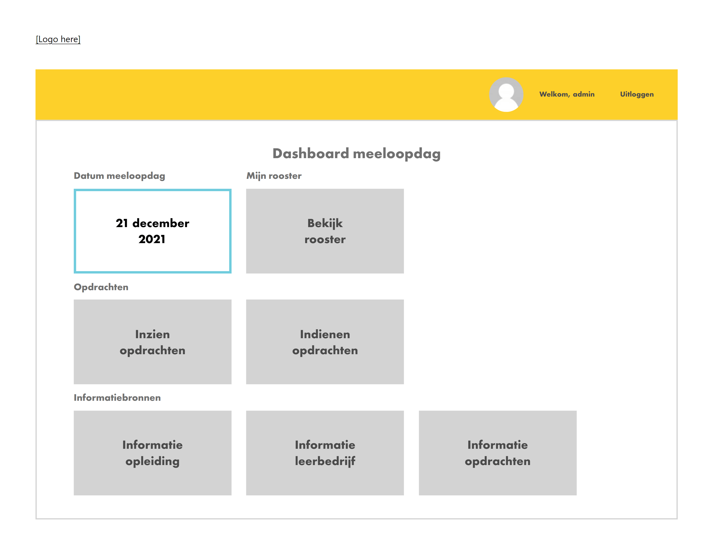
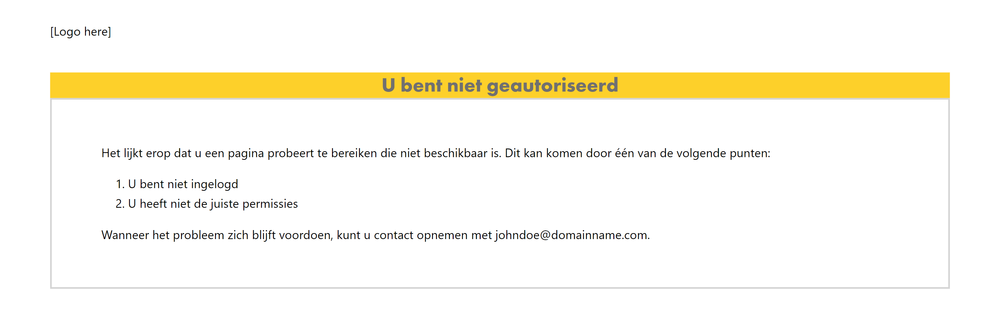
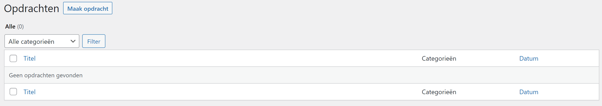
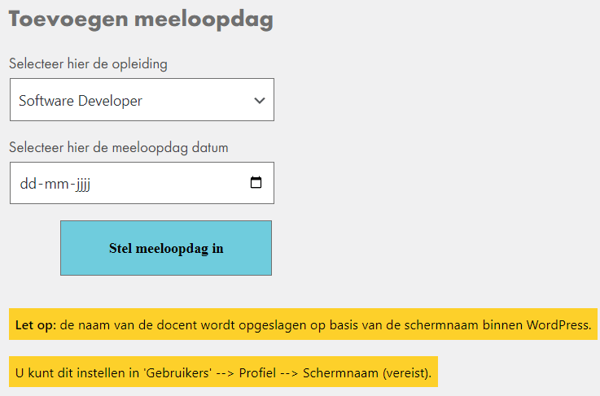
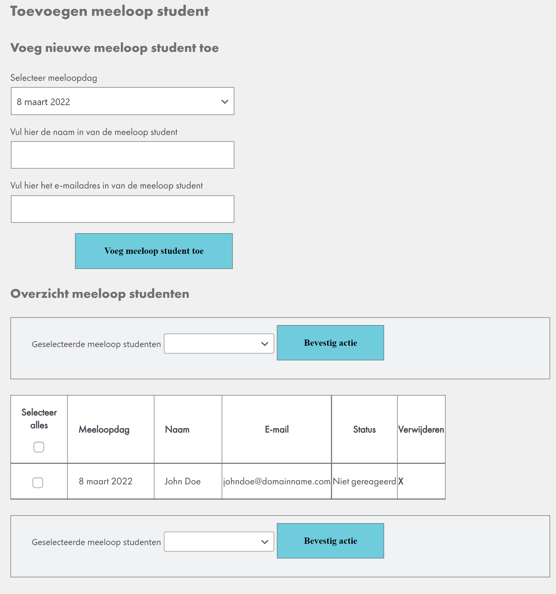
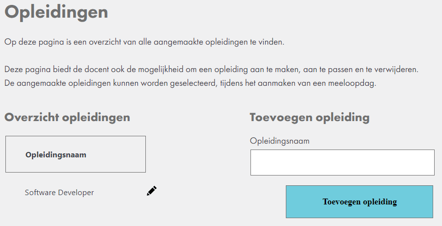
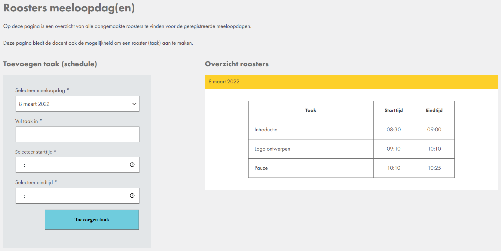
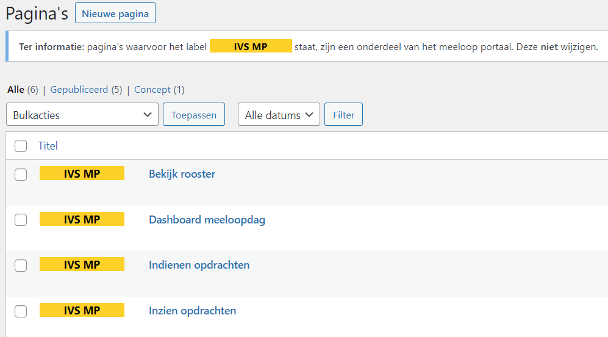

# Project name: Meeloop portaal (Dutch)
## WordPress plugin

## :books: Description
Project 'Meeloop portaal IVS' is a Dutch project in which I had the task to develop a portal for teachers and students of an educational institute.

The project itself is not complete because some features are still missing. The dashboard of the student, for example, is currently static but should have been loading the different components in dynamically.

## Table of contents

- [Features students](#sparkles-features-students)
- [Features teachers](#sparkles-features-teachers)
- [Features back-end](#sparkles-features-back-end)
- [Made with](#made-with)
- [Screenshots](#screenshots)
  - [Dashboard student](#dashboard-student)
  - [Page for unauthorised people](#page-for-unauthorised-people)
  - [Adding new task feature](#adding-new-task-feature)
  - [Adding new open day feature](adding-new-open-day-feature)
  - [Adding new student feature](#adding-new-student-feature)
  - [Adding new education feature](#adding-new-education-feature)
  - [Adding new schedule feature](#adding-new-schedule-feature)
  - [Automatically generated WordPress pages](#automatically-generated-wordpress-pages)

### :sparkles: Features students
The only feature the students currently have is their dashboard.
However, this dashboard is currently not accessible, because the students can only register themselves if they received an invitation
from one of the teachers. This feature, however, has not been developed yet.

### :sparkles: Features teachers
Teachers have the following features:
1. Create a new task for students participating in the open day
2. Create a new open day for students
   * Teachers can select the education and open day date to create a new open day
   * Name of the teacher who adds this open day is also added to the database. The name itself is retrieved automatically by WordPress and therefore does not require any action of the teacher.
3. Add a new student to the open day for the education
   * Teachers can select the open day date and fill in the student's name and email-address
4. See an overview of the already added students (see point 3 above)
   * This overview shows the names and email addresses of the students, the open day date on which they registered themselves, and the current status of their email _(the students must confirm their email addresses to create their account and gain access to their dashboard)_.
   * This overview offers the teachers to:
      * Select multiple students at once (or all of them) to either send an invitation or delete them
      * Send an invitation to a specific student only, or delete this student
5. Delete a student _(a confirmation box will be shown, to make sure the student is not deleted by accident)_
6. Create a new education
7. Edit an existing education _(the delete feature has not been developed)_
8. Create a schedule for a specific open day
   * The information that the user can fill in is as follows:
      * Select the specific open day date
      * Fill in the task name
      * Select the start time of this task
      * Select the end time of this task
9. See an overview of all previously added schedules in the shape of a collapse 

### :sparkles: Features back-end
The back-end has the following features:
1. Automatic creation of the database tables 
2. Automatic insertion of data into the database tables
3. Automatic creation of new capabilities _(for the User Access Management System that WordPress uses)_
4. Automatic creation of WordPress pages that are associated with the dashboard for the student

These features are introduced so the developer does not have to create the database tables, insert the data into these tables, create the  capabilities and WordPress pages themselves.

### Made with
- WordPress version 5.9.2
- HTML(5)
- CSS
- JavaScript (+ES6)
- PHP (Object-Oriented Programming)
- GitHub
- Git

## Screenshots
This section includes all the screenshots of the application.
As mentioned earlier, this is a Dutch project, and therefore the language in the screenshots is also Dutch.

### Dashboard student

### Page for unauthorised people

### Adding new task feature
This feature has been developed by using custom post types within WordPress

### Adding new open day feature

### Adding new student feature
There are some alignment issues which I haven't solved yet.

### Adding new education feature

### Adding new schedule feature

### Automatically generated WordPress pages

